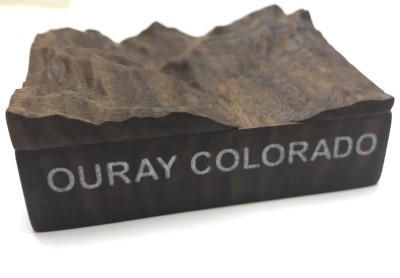

# topo-box
Small boxes with lids that are topographic reliefs.  The goal of this project relative to others is to add labelled elevation contours to the topographic relief with a laser etcher.  This requires generation of 3D laser tool paths.

# Tools
* [TouchTerrain](https://touchterrain.geol.iastate.edu/)
  * TouchTerrain is used to generate the STL for the models.
  * It also provides data that is used for creation of the elevation contour lines that are laser etched. 
* [stl2topo_contours.py](oregon-black-butte/stl2topo_contours.py)
  * Custom developed script that takes STL and additional data, and creates topographic elevation contour lines.
  * Contour lines are converted into 3D laser paths for etching into the model.
* [Open Street Map](https://openstreetmap.org)
  * Provides SVG street map data that can be converted to laser paths with [InkScape](https://inkscape.org/), see: https://github.com/doug-harriman/3018-Mill#laser
  * Maps can take latitude and longitude data from TouchTerrain output so that map outline exactly matches STL outline.
  * Note that street maps contain a lot of data an need significant cleanup before generating laser paths. 
* [Fusion360](https://www.autodesk.com/products/fusion-360/) for modeling and CNC tool paths.

## Elevation Contour Generation Tool Process Overview
* STL downloaded from TouchTerrain.

* [stl2topo_contours.py](oregon-black-butte/stl2topo_contours.py) generation of 3D laser tool paths for elevation contours.
  * STL data read with [Numpy-STL](https://github.com/WoLpH/numpy-stl/)
  * Triangle mesh converted to a height matrix via a series of Numpy ND array set and reshape operations.
  * Contour lines generated with [Matplotlib contour](https://matplotlib.org/stable/api/_as_gen/matplotlib.pyplot.contour.html)

  

  * Contour line object converted to Laser G-Code paths with a simple function.

* [svg2topo.py](oregon-black-butte/svg2topo.py) conversion 2D SVG road & trail maps to 3D laser tool paths to match topographic Z-values.

# Colorado, Ouray
* First topo box project.  Unfortunately, I did not save model files.
* Milled from 3/4" black walnut ordered on Amazon.
* Model from: https://jthatch.com/Terrain2STL/, did not save exact model, loaded into Fusion360 for milling.
* Surface:
  * Roughed with 2mm ball endmill
  * Finished with 1mm ball endmill, 0.1 mm stepover
* Lettering
  * Clear Expoxy Casting Resin
    * [Purchase](https://www.amazon.com/gp/product/B089XZJFG5)
  * Colorant:  Satin White Synthetic Mica Powder
    * [Purchase](https://www.amazon.com/gp/product/B07KS7WTR2)
    * Tried to mix in manually, did not mix in well enough.  Coloring is inconsistent.  Highly recommend mixing in with a rotary tool.
    * Did not have issues with bubbles and did not degass.  

# Oregon, Black Butte

* [TouchTerrain](https://touchterrain.geol.iastate.edu/?trlat=44.429197180580594&trlon=-121.59384723130317&bllat=44.3616143717882&bllon=-121.68289944838435&DEM_name=USGS/NED&tilewidth=100&printres=0.2&ntilesx=1&ntilesy=1&DEMresolution=14.19&basethick=1&zscale=-25.4&fileformat=STLb&maptype=roadmap&gamma=1&transp=20&hsazi=315&hselev=45&map_lat=44.38402186929164&map_lon=-121.65242965263509&map_zoom=13) model.
* Artwork
  * URL [QR Code Generator](https://qrd.by/qr-code-generator-svg) for a QR code that points to this repository.
  * [Oregon Map Outline](https://commons.wikimedia.org/wiki/File:Blank_US_Map_(states_only).svg) extracted from a US map.
  * [Black Butted Info](https://en.wikipedia.org/wiki/Black_Butte_(Oregon))
  * [US Highway 20 Sign](https://commons.wikimedia.org/wiki/File:US_Route_20_in_Illinois_Road_Sign.svg).  Reworked in Inkscape.
  * [Black Butte Ranch Logo](https://www.blackbutteranchhoa.com/images/logo.png), autotraced and cropped in Inkscape.

# Fabrication Steps
1. Download zip file from TouchTerrain.
2. Unzip.
3. Determine model maximum sizes based on material & tool limits.
4. Mill bottom side of model flat.
5. Cut model/box outline.
7. Finish sand bottom side of model.
6. Generate any bottom side artwork.
8. Laser etch bottom side.
9. Generate topographic model tool paths.
10. TouchTerrain models are high fidelty.  As such, there may be too many polygons for Fusion360 to handle.  See [this article](https://toglefritz.com/convert-a-complex-stl-into-a-body-in-fusion-360/) for tips on how to reduce the model polygon count. 
11. Mill topo model surface.
12. Finish sand top surface.
13. Generate contour line laser paths with stl2topo_contours.py
14. Generate additional artwork SVG (such as roads, compass rose, etc.)
15. Project artwork SVG to surface in Fusion360.
16. Generate artwork laser paths in Fusion360.
17. Laser etch topside.
